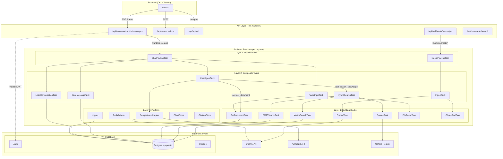
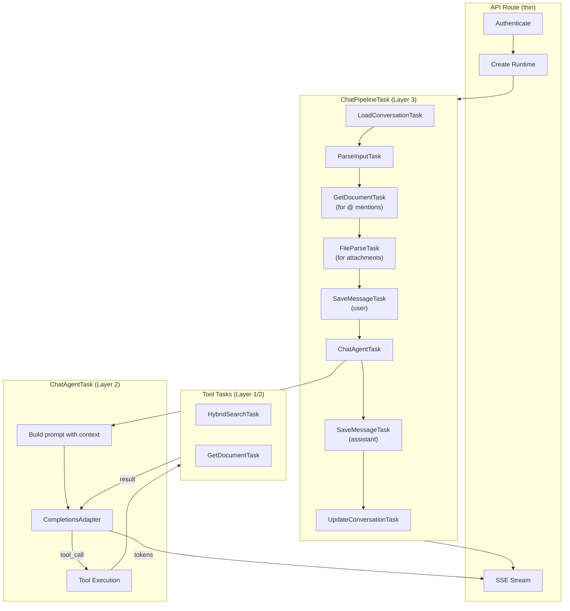
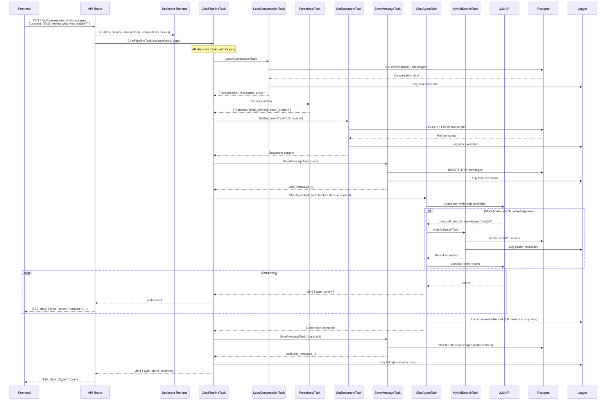
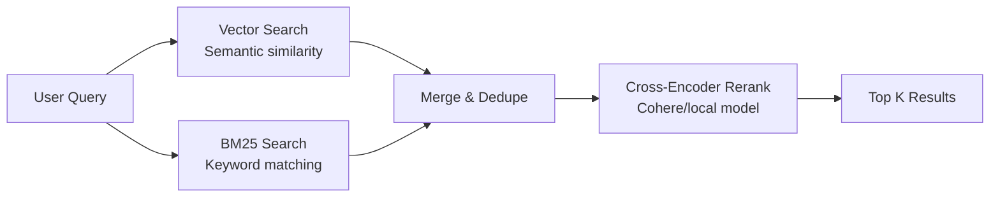

# OxyChat Backend Migration PRD (Product Requirements Document)

## Exec Summary/Context
Oxy is a design and product studio that works with funded startups, proven entrepreneurs, and enterprises on branding, product design, and marketing. We sit at the intersection of strategy and execution—helping companies build brands, design digital products, and create content that drives measurable business outcomes. Our team spans Phoenix, New York, San Francisco, and LA, with clients ranging from early-stage companies to brands like LinkedIn and New Era.

Sediment is a custom and secret framework for building with LLMs developed by Oxy's head of growth Andrew.

**Scope**: This PRD covers the backend architecture only. Frontend design is out of scope. The focus is on API contracts, data models, and Task definitions that the frontend will consume.

## 1. Overview
OxyChat is the internal "Operating System" for our company's intelligence. It is a multi-user system where Oxy team members authenticate via their Oxy Google accounts. It is not just a chatbot; it is a unified interface that allows team members to:
1.  **Chat** with frontier models (Claude/OpenAI) for general tasks.
2.  **Query** internal knowledge (Sales calls, internal meeting transcripts) with precision.
3.  **Dispatch** autonomous agents to perform background research or operational tasks.

It is built on the **Sediment Framework**, ensuring that every interaction is observable, replayable, and composable. Supported models: GPT-5.2, Claude Sonnet 4.5, Claude Opus 4.5.

## 2. Goals & Scope

### 2.1 MVP Goals (The "Walking Skeleton")
*   **Multi-User Authentication**: Google OAuth login restricted to @oxy.so domain.
*   **Conversation Management**: Users can create, view, and continue chat threads.
*   **Streaming Responses**: Real-time token streaming via Server-Sent Events (SSE).
*   **Transcript Ingestion**: Automated pipeline to ingest webhooks from our transcription service.
*   **@ Mentions (Transcripts)**: Reference specific transcripts by name in chat.
*   **Observability**: Full logging using Sediment's `CompletionRecord` standard (from day one).

### 2.2 Future Scope (Post-MVP)
*   **RAG Capabilities**: Hybrid search (vector + BM25) to answer questions across all transcripts.
*   **File Attachments**: Upload files (PDF, DOCX, etc.) as context for conversations.
*   **Shared Document Library**: Persistent, searchable file storage (beyond conversation context).
*   **Google Workspace Integration**: Access Gmail, Calendar, Drive for richer context.
*   **Shared Conversations**: Multiple users collaborating in the same thread.
*   **Autonomous Agents**: Background tasks with notifications on completion.
*   **Entity Enrichment**: Auto-generating "Wikis" for companies/people mentioned in calls.
*   **Proactive Alerting**: Background scanning for keywords or sentiment shifts.

## 3. Architecture Strategy

We use a **Hybrid Agent-with-Tools** architecture built on the Sediment 3-Layer model. The user talks directly to a model, which has access to tools (search, document retrieval) and decides when to use them. This feels natural while keeping the underlying operations observable and composable.

### 3.0 Design Principles

1. **Chat-first UX**: User talks to a model directly, not to a "router"
2. **Tools are Tasks**: Each tool the model can call is a Sediment Task (typed, logged, testable)
3. **Explicit > Implicit**: `@document` mentions are parsed deterministically before the model sees the message
4. **Hybrid Retrieval**: When searching, use vector + BM25 + re-ranking for best results

### 3.1 System Architecture Diagram



### 3.2 Tech Stack

| Component | Technology | Notes |
|-----------|------------|-------|
| **Backend** | Hono (TypeScript, Node.js) | Standalone service on Railway |
| **AI Framework** | Sediment | Core, Runtime, Adapters |
| **Database** | Supabase Postgres + pgvector | Business data + vectors |
| **Search** | pgvector + pg_trgm | Semantic + BM25 |
| **Re-ranking** | Cohere Rerank API | Or open-source cross-encoder |
| **File Storage** | Supabase Storage | Conversation attachments |
| **Auth** | Supabase Auth + Google OAuth | Restricted to @oxy.so |
| **Streaming** | Server-Sent Events (SSE) | Real-time tokens |

### 3.3 The Sediment Layers

| Layer | Component | Responsibility | MVP Implementation |
| :--- | :--- | :--- | :--- |
| **Layer 3** | **API Routes** | HTTP handlers, auth, SSE | • `POST /api/conversations/:id/messages`<br>• `POST /api/webhooks/transcripts`<br>• `GET /api/documents/search` |
| **Layer 2** | **Agent Task** | Model + tool orchestration | • **ChatAgentTask**: Model with tools<br>• **IngestTask**: Transcript processing |
| **Layer 1** | **Building Blocks** | Atomic operations | • `HybridSearchTask`<br>• `GetDocumentTask`<br>• `VectorSearchTask`<br>• `BM25SearchTask`<br>• `RerankTask`<br>• `EmbedTask` |
| **Layer 0** | **Platform** | Sediment infrastructure | • CompletionsAdapter<br>• ToolsAdapter<br>• Logger, Stores |

### 3.4 The Chat Pipeline (Everything is a Task)

The entire chat flow is a Sediment Task that orchestrates sub-tasks. The API route just creates a Runtime and calls `ChatPipelineTask`.



### 3.5 Request Flow Sequence



### 3.5 Retrieval Strategy

OxyChat supports two retrieval modes:

#### Mode A: Explicit Reference (`@document_name`)
- User explicitly tags a document using `@` syntax
- Document is fetched in full (or smart-chunked for large docs)
- Included directly in model context BEFORE the model runs
- No search ranking needed - user said "this one"

```
User: "@acme_sales_call what did they say about pricing?"
→ Parser extracts: @acme_sales_call
→ Full transcript fetched and added to context
→ Model answers with that context
```

#### Mode B: Implicit Search (via tool)
- Model decides to search when user asks about internal knowledge
- Uses hybrid retrieval pipeline:



| Step | Purpose | Implementation |
|------|---------|----------------|
| **Vector Search** | Find semantically similar chunks | pgvector cosine similarity |
| **BM25 Search** | Find keyword matches | pg_trgm or custom BM25 |
| **Merge** | Combine results, remove duplicates | Reciprocal Rank Fusion |
| **Rerank** | Score relevance precisely | Cohere rerank-v3 or cross-encoder |

### 3.6 Runtime Configuration

Every request creates a Sediment Runtime with injected dependencies. All Tasks receive these deps.

```typescript
// Runtime configuration for OxyChat
const runtime = Runtime.create({
  // Observability - enables logging and tracing
  observability: {
    productName: 'oxychat',
    requestId: crypto.randomUUID(),  // Unique per request
    userId: user.id,                  // For querying logs
    conversationId: params.id,        // For querying logs
    environment: process.env.NODE_ENV,
  },
  
  // CompletionsAdapter - handles all LLM calls
  completions: createAnthropicAdapter({
    apiKey: process.env.ANTHROPIC_API_KEY,
    maxConcurrent: 5,
    retries: { maxAttempts: 3, backoff: 'exponential' },
  }),
  
  // ToolsAdapter - tools the model can call (each is a Task)
  tools: createToolsAdapter({
    search_knowledge: {
      description: 'Search company transcripts and documents',
      parameters: { query: 'string', limit: 'number?' },
      execute: (args, deps) => runTask(HybridSearchTask, args, deps),
    },
    get_document: {
      description: 'Get a specific document by name',
      parameters: { document_name: 'string' },
      execute: (args, deps) => runTask(GetDocumentTask, args, deps),
    },
  }),
  
  // Database client - injected for Tasks to use
  db: createSupabaseClient({
    url: process.env.SUPABASE_URL,
    serviceKey: process.env.SUPABASE_SERVICE_KEY,
  }),
  
  // Logger - writes CompletionRecords to database
  logger: createSupabaseLogStore({
    tableName: 'completion_logs',
  }),
  
  // Stores - for effects and citations
  effects: new EffectStore(),
  citations: new CitationStore(),
});

// All Tasks receive deps from runtime
const deps = runtime.getDeps();
// deps.completions - for LLM calls
// deps.tools - for tool execution
// deps.db - for database access
// deps.logger - for logging
// deps.effects - for collecting effects
// deps.citations - for tracking citations
```

### 3.7 Tool Definitions for Model

The ChatAgentTask gives the model access to these tools:

```typescript
const tools = [
  {
    name: "search_knowledge",
    description: "Search through company transcripts and documents. Use when the user asks about internal meetings, calls, or company knowledge.",
    parameters: {
      query: { type: "string", description: "The search query" },
      limit: { type: "number", description: "Max results (default 5)" },
    }
  },
  {
    name: "get_document", 
    description: "Retrieve a specific document by name or ID. Use when you need the full content of a known document.",
    parameters: {
      document_name: { type: "string", description: "Name or ID of document" },
    }
  }
];
```

The model naturally decides:
- "Help me write an email" → No tool call, just responds
- "What did the client say about budget?" → Calls `search_knowledge`
- "Summarize the Acme meeting" → Calls `get_document` if known, or `search_knowledge` if not

## 4. Data Architecture

We use **Supabase** (Postgres + pgvector + Storage) to unify all data needs.

### 4.1 Complete Database Schema

#### Users & Auth
```sql
-- Managed by Supabase Auth, but we extend with a profile
CREATE TABLE user_profiles (
    id UUID PRIMARY KEY REFERENCES auth.users(id) ON DELETE CASCADE,
    email TEXT NOT NULL UNIQUE,
    display_name TEXT,
    avatar_url TEXT,
    preferences JSONB DEFAULT '{}',  -- e.g., {"default_model": "claude-sonnet-4.5"}
    created_at TIMESTAMPTZ DEFAULT NOW(),
    updated_at TIMESTAMPTZ DEFAULT NOW()
);

-- Row Level Security: users can only access their own profile
ALTER TABLE user_profiles ENABLE ROW LEVEL SECURITY;
CREATE POLICY "Users can view own profile" ON user_profiles
    FOR SELECT USING (auth.uid() = id);
CREATE POLICY "Users can update own profile" ON user_profiles
    FOR UPDATE USING (auth.uid() = id);
```

#### Conversations & Messages
```sql
CREATE TABLE conversations (
    id UUID PRIMARY KEY DEFAULT gen_random_uuid(),
    user_id UUID NOT NULL REFERENCES auth.users(id) ON DELETE CASCADE,
    title TEXT,  -- Auto-generated from first message or user-set
    model TEXT NOT NULL DEFAULT 'claude-sonnet-4.5',
    created_at TIMESTAMPTZ DEFAULT NOW(),
    updated_at TIMESTAMPTZ DEFAULT NOW()
);

CREATE INDEX idx_conversations_user_id ON conversations(user_id);
CREATE INDEX idx_conversations_updated_at ON conversations(updated_at DESC);

CREATE TABLE messages (
    id UUID PRIMARY KEY DEFAULT gen_random_uuid(),
    conversation_id UUID NOT NULL REFERENCES conversations(id) ON DELETE CASCADE,
    role TEXT NOT NULL CHECK (role IN ('user', 'assistant', 'system')),
    content TEXT NOT NULL,
    citations JSONB DEFAULT '[]',  -- [{id, source, snippet}]
    token_count INTEGER,
    model TEXT,  -- Only for assistant messages
    created_at TIMESTAMPTZ DEFAULT NOW()
);

CREATE INDEX idx_messages_conversation_id ON messages(conversation_id);
CREATE INDEX idx_messages_created_at ON messages(created_at);
```

#### File Attachments
```sql
CREATE TABLE attachments (
    id UUID PRIMARY KEY DEFAULT gen_random_uuid(),
    message_id UUID NOT NULL REFERENCES messages(id) ON DELETE CASCADE,
    file_name TEXT NOT NULL,
    file_type TEXT NOT NULL,  -- MIME type
    file_size INTEGER NOT NULL,  -- bytes
    storage_path TEXT NOT NULL,  -- Path in Supabase Storage
    extracted_text TEXT,  -- Parsed text content (for context)
    created_at TIMESTAMPTZ DEFAULT NOW()
);

CREATE INDEX idx_attachments_message_id ON attachments(message_id);
```

#### Transcripts (RAG Source)
```sql
CREATE TABLE transcripts (
    id UUID PRIMARY KEY DEFAULT gen_random_uuid(),
    source_id TEXT UNIQUE,  -- External ID from transcription service
    title TEXT NOT NULL,
    raw_text TEXT NOT NULL,
    metadata JSONB DEFAULT '{}',  -- {speakers: [], duration_seconds, date, meeting_type}
    -- Full-text search on title for @ mention lookup
    title_search tsvector GENERATED ALWAYS AS (to_tsvector('english', coalesce(title, ''))) STORED,
    created_at TIMESTAMPTZ DEFAULT NOW(),
    updated_at TIMESTAMPTZ DEFAULT NOW()
);

CREATE INDEX idx_transcripts_title_search ON transcripts USING GIN(title_search);
CREATE INDEX idx_transcripts_title_trgm ON transcripts USING GIN(title gin_trgm_ops);

CREATE TABLE transcript_chunks (
    id UUID PRIMARY KEY DEFAULT gen_random_uuid(),
    transcript_id UUID NOT NULL REFERENCES transcripts(id) ON DELETE CASCADE,
    chunk_index INTEGER NOT NULL,
    content TEXT NOT NULL,
    embedding vector(1536),  -- OpenAI text-embedding-3-small dimensions
    -- BM25/full-text search support
    content_search tsvector GENERATED ALWAYS AS (to_tsvector('english', content)) STORED,
    metadata JSONB DEFAULT '{}',  -- {speaker, timestamp_start, timestamp_end}
    created_at TIMESTAMPTZ DEFAULT NOW()
);

-- Vector search index (semantic)
CREATE INDEX idx_transcript_chunks_embedding ON transcript_chunks 
    USING ivfflat (embedding vector_cosine_ops) WITH (lists = 100);

-- Full-text search index (BM25-like)
CREATE INDEX idx_transcript_chunks_content_search ON transcript_chunks USING GIN(content_search);

-- Trigram index for fuzzy matching
CREATE INDEX idx_transcript_chunks_content_trgm ON transcript_chunks USING GIN(content gin_trgm_ops);

CREATE INDEX idx_transcript_chunks_transcript_id ON transcript_chunks(transcript_id);
```

**Search Functions:**
```sql
-- Hybrid search function combining vector + BM25
CREATE OR REPLACE FUNCTION hybrid_search(
    query_embedding vector(1536),
    query_text text,
    match_limit int DEFAULT 20,
    vector_weight float DEFAULT 0.5,
    bm25_weight float DEFAULT 0.5
)
RETURNS TABLE (
    chunk_id uuid,
    transcript_id uuid,
    content text,
    metadata jsonb,
    vector_score float,
    bm25_score float,
    combined_score float
) AS $$
BEGIN
    RETURN QUERY
    WITH vector_results AS (
        SELECT 
            tc.id,
            tc.transcript_id,
            tc.content,
            tc.metadata,
            1 - (tc.embedding <=> query_embedding) as score
        FROM transcript_chunks tc
        ORDER BY tc.embedding <=> query_embedding
        LIMIT match_limit * 2
    ),
    bm25_results AS (
        SELECT 
            tc.id,
            tc.transcript_id,
            tc.content,
            tc.metadata,
            ts_rank_cd(tc.content_search, plainto_tsquery('english', query_text)) as score
        FROM transcript_chunks tc
        WHERE tc.content_search @@ plainto_tsquery('english', query_text)
        ORDER BY score DESC
        LIMIT match_limit * 2
    ),
    combined AS (
        SELECT 
            COALESCE(v.id, b.id) as id,
            COALESCE(v.transcript_id, b.transcript_id) as transcript_id,
            COALESCE(v.content, b.content) as content,
            COALESCE(v.metadata, b.metadata) as metadata,
            COALESCE(v.score, 0) as v_score,
            COALESCE(b.score, 0) as b_score
        FROM vector_results v
        FULL OUTER JOIN bm25_results b ON v.id = b.id
    )
    SELECT 
        c.id as chunk_id,
        c.transcript_id,
        c.content,
        c.metadata,
        c.v_score as vector_score,
        c.b_score as bm25_score,
        (c.v_score * vector_weight + c.b_score * bm25_weight) as combined_score
    FROM combined c
    ORDER BY combined_score DESC
    LIMIT match_limit;
END;
$$ LANGUAGE plpgsql;
```

#### Sediment Observability
```sql
CREATE TABLE completion_logs (
    id UUID PRIMARY KEY DEFAULT gen_random_uuid(),
    completion_id TEXT NOT NULL UNIQUE,
    context_id TEXT NOT NULL,  -- Groups all calls in one request
    request_id TEXT,  -- User-facing request ID
    user_id UUID REFERENCES auth.users(id),
    conversation_id UUID REFERENCES conversations(id),
    
    -- Location
    product_name TEXT DEFAULT 'oxychat',
    product_step TEXT NOT NULL,  -- e.g., 'router', 'rag_search', 'synthesize'
    
    -- Payload (full for replay)
    model TEXT NOT NULL,
    params JSONB NOT NULL,  -- Full request params
    completion TEXT NOT NULL,  -- Full response
    
    -- Timing
    request_started_at TIMESTAMPTZ NOT NULL,
    request_first_token_at TIMESTAMPTZ,
    request_ended_at TIMESTAMPTZ NOT NULL,
    duration_ms INTEGER GENERATED ALWAYS AS (
        EXTRACT(EPOCH FROM (request_ended_at - request_started_at)) * 1000
    ) STORED,
    
    -- Metrics
    input_tokens INTEGER,
    output_tokens INTEGER,
    cost_usd DECIMAL(10, 6),
    
    created_at TIMESTAMPTZ DEFAULT NOW()
);

CREATE INDEX idx_completion_logs_context_id ON completion_logs(context_id);
CREATE INDEX idx_completion_logs_user_id ON completion_logs(user_id);
CREATE INDEX idx_completion_logs_conversation_id ON completion_logs(conversation_id);
CREATE INDEX idx_completion_logs_created_at ON completion_logs(created_at DESC);

CREATE TABLE effects (
    id UUID PRIMARY KEY DEFAULT gen_random_uuid(),
    context_id TEXT NOT NULL,
    type TEXT NOT NULL,  -- e.g., 'send_email', 'create_alert'
    payload JSONB NOT NULL,
    status TEXT NOT NULL DEFAULT 'pending' CHECK (status IN ('pending', 'executed', 'cancelled')),
    executed_at TIMESTAMPTZ,
    created_at TIMESTAMPTZ DEFAULT NOW()
);

CREATE INDEX idx_effects_context_id ON effects(context_id);
CREATE INDEX idx_effects_status ON effects(status);
```

### 4.2 Supabase Storage Buckets

```
attachments/
├── {user_id}/
│   └── {conversation_id}/
│       └── {attachment_id}_{filename}
```

Storage bucket policy: Users can only access files in their own user_id folder.

### 4.3 Row Level Security Summary

| Table | Policy |
|-------|--------|
| user_profiles | Users access own profile only |
| conversations | Users access own conversations only |
| messages | Users access messages in own conversations |
| attachments | Users access attachments in own conversations |
| transcripts | All authenticated users can read (company data) |
| transcript_chunks | All authenticated users can read |
| completion_logs | Admin only (or user can see own) |
| effects | Admin only |

## 5. API Specifications

### 5.1 Authentication

**Google OAuth Flow** (handled by Supabase Auth):
1. Frontend redirects to `/api/auth/google`
2. Supabase handles OAuth with Google
3. On success, Supabase sets secure HTTP-only cookie with JWT
4. All subsequent API calls include this cookie
5. Domain restriction: Only @oxy.so emails can authenticate

```typescript
// Middleware validates auth on all /api/* routes except webhooks
type AuthenticatedRequest = {
  user: {
    id: string;      // UUID
    email: string;   // user@oxy.so
  };
};
```

### 5.2 API Endpoints

#### POST /api/conversations
Create a new conversation.

```typescript
// Request
{ }  // Empty body, or optional { title?: string, model?: string }

// Response
{
  id: string;
  title: string | null;
  model: string;
  created_at: string;
}
```

#### GET /api/conversations
List user's conversations (paginated, most recent first).

```typescript
// Query params
?limit=20&cursor=<conversation_id>

// Response
{
  conversations: Array<{
    id: string;
    title: string | null;
    model: string;
    updated_at: string;
    preview: string;  // First ~100 chars of last message
  }>;
  next_cursor: string | null;
}
```

#### GET /api/conversations/:id
Get conversation with messages.

```typescript
// Response
{
  id: string;
  title: string | null;
  model: string;
  messages: Array<{
    id: string;
    role: 'user' | 'assistant' | 'system';
    content: string;
    citations: Citation[];
    attachments: Array<{
      id: string;
      file_name: string;
      file_type: string;
      file_size: number;
    }>;
    created_at: string;
  }>;
}
```

#### POST /api/conversations/:id/messages
Send a message and receive streaming response.

```typescript
// Request (multipart/form-data for file uploads)
{
  content: string;
  attachments?: File[];  // Optional file uploads
}

// Response: Server-Sent Events stream
// Event types:
data: {"type": "token", "content": "Hello"}
data: {"type": "token", "content": " world"}
data: {"type": "citation", "citation": {"id": "c1", "source": "...", "snippet": "..."}}
data: {"type": "done", "message_id": "uuid", "citations": [...]}
data: {"type": "error", "error": "Rate limited", "code": "RATE_LIMIT"}
```

#### POST /api/upload
Pre-upload files before sending message (for large files).

```typescript
// Request (multipart/form-data)
{
  file: File;
  conversation_id: string;
}

// Response
{
  attachment_id: string;
  file_name: string;
  file_type: string;
  file_size: number;
  extracted_text: string | null;  // If parseable
}
```

#### POST /api/webhooks/transcripts
Ingest webhook from transcription service (no auth, uses webhook secret).

```typescript
// Request
{
  source_id: string;
  title: string;
  text: string;
  metadata: {
    speakers?: string[];
    duration_seconds?: number;
    date?: string;
    meeting_type?: string;
  };
}

// Response
{ success: true, transcript_id: string }
```

#### GET /api/documents/search
Search documents for @ mention autocomplete and general search.

```typescript
// Query params
?q=acme&type=transcript&limit=10

// Response
{
  documents: Array<{
    id: string;
    title: string;
    type: 'transcript' | 'attachment';
    preview: string;  // First ~200 chars
    metadata: {
      date?: string;
      speakers?: string[];
    };
    updated_at: string;
  }>;
}
```

#### GET /api/documents/:id
Get full document content.

```typescript
// Response
{
  id: string;
  title: string;
  type: 'transcript' | 'attachment';
  content: string;  // Full text
  metadata: Record<string, unknown>;
  created_at: string;
}
```

### 5.3 SSE Streaming Protocol

The `/api/conversations/:id/messages` endpoint returns a text/event-stream response:

```typescript
// Connection setup
const eventSource = new EventSource(`/api/conversations/${id}/messages`, {
  method: 'POST',
  body: formData,
});

// SSE Message Types
type SSEMessage = 
  | { type: 'token'; content: string }
  | { type: 'citation'; citation: Citation }
  | { type: 'done'; message_id: string; citations: Citation[] }
  | { type: 'error'; error: string; code: string };

// Connection closes after 'done' or 'error'
```

**Implementation Note**: Since standard SSE only supports GET, we use a pattern where:
1. POST creates the message and returns a `stream_id`
2. Frontend connects to GET `/api/streams/:stream_id` for SSE
3. Or: Use fetch with `ReadableStream` for POST-based streaming

## 6. Task Definitions

### 6.1 Layer 1: Building Block Tasks

```typescript
// === SEARCH TASKS ===

// VectorSearchTask - Semantic similarity search
type VectorSearchTask = Task<
  { 
    query_embedding: number[];  // Pre-computed embedding
    limit?: number;
    filter?: { transcript_ids?: string[] };
  },
  Array<{
    chunk_id: string;
    transcript_id: string;
    content: string;
    score: number;
    metadata: ChunkMetadata;
  }>
>;

// BM25SearchTask - Keyword/full-text search
type BM25SearchTask = Task<
  {
    query: string;
    limit?: number;
    filter?: { transcript_ids?: string[] };
  },
  Array<{
    chunk_id: string;
    transcript_id: string;
    content: string;
    score: number;
    metadata: ChunkMetadata;
  }>
>;

// RerankTask - Cross-encoder reranking
type RerankTask = Task<
  {
    query: string;
    documents: Array<{ id: string; content: string }>;
    top_k?: number;
  },
  Array<{
    id: string;
    content: string;
    relevance_score: number;
  }>
>;
// Uses: Cohere rerank-v3 or local cross-encoder

// === DOCUMENT TASKS ===

// GetDocumentTask - Fetch full document by ID or name
type GetDocumentTask = Task<
  { 
    document_id?: string;
    document_name?: string;  // For @ mention lookup
    document_type: 'transcript' | 'attachment';
  },
  {
    id: string;
    title: string;
    content: string;  // Full text
    metadata: DocumentMetadata;
  } | null
>;

// EmbedTask - Generate embeddings
type EmbedTask = Task<
  { texts: string[] },
  { embeddings: number[][] }
>;
// Uses: OpenAI text-embedding-3-small

// FileParseTask - Extract text from files
type FileParseTask = Task<
  { file_path: string; file_type: string },
  { text: string; metadata: Record<string, unknown> }
>;
// Supports: PDF, DOCX, TXT, MD, code files
```

### 6.2 Layer 2: Composite Tasks

```typescript
// HybridSearchTask - Full retrieval pipeline
type HybridSearchTask = Task<
  {
    query: string;
    limit?: number;  // Default 10
    vector_weight?: number;  // Default 0.5
    bm25_weight?: number;  // Default 0.5
  },
  Array<{
    chunk_id: string;
    transcript_id: string;
    transcript_title: string;
    content: string;
    relevance_score: number;
    metadata: ChunkMetadata;
  }>
>;
// Implementation:
// 1. EmbedTask(query) -> query_embedding
// 2. Parallel: VectorSearchTask + BM25SearchTask
// 3. Merge results (Reciprocal Rank Fusion)
// 4. RerankTask -> final scored results
// 5. Register citations in CitationStore

// ChatAgentTask - Main chat with tools
type ChatAgentTask = Task<
  {
    message: string;
    conversation_history: Message[];
    context: {
      fetched_documents: Document[];  // From @ mentions
      attachments: Attachment[];
    };
    model: string;
  },
  string  // Streams tokens
>;
// Implementation:
// 1. Build system prompt with available tools
// 2. Include fetched_documents in context
// 3. Call model with tool definitions
// 4. If tool_call: execute tool, add result, continue
// 5. Stream final response
// Tools available: search_knowledge, get_document

// IngestTask - Process incoming transcript
type IngestTask = Task<
  { 
    source_id: string;
    title: string;
    text: string;
    metadata: Record<string, unknown>;
  },
  { 
    transcript_id: string;
    chunk_count: number;
  }
>;
// Implementation:
// 1. Save raw transcript to transcripts table
// 2. Chunk text (512 tokens, 50 token overlap)
// 3. EmbedTask for all chunks (batched)
// 4. Save chunks with embeddings to transcript_chunks
```

### 6.3 Layer 3: Pipeline Tasks (Full Chat Flow)

The entire chat flow is a Sediment pipeline. The API route just creates a Runtime and calls the top-level Task.

```typescript
// ============================================
// TYPES
// ============================================

type ChatPipelineInput = {
  user_id: string;
  conversation_id: string;
  content: string;
  attachment_ids: string[];  // Pre-uploaded attachment IDs
};

type ChatPipelineOutput = 
  | { type: 'token'; content: string }
  | { type: 'citation'; citation: Citation }
  | { type: 'tool_start'; tool: string; args: unknown }
  | { type: 'tool_end'; tool: string; result: unknown }
  | { type: 'done'; user_message_id: string; assistant_message_id: string; citations: Citation[] };

// ============================================
// CHAT PIPELINE TASK (Layer 3)
// ============================================

const ChatPipelineTask = defineTask<ChatPipelineInput, ChatPipelineOutput>(
  'chat_pipeline',
  async function* (input, deps) {
    const { user_id, conversation_id, content, attachment_ids } = input;
    
    // ----------------------------------------
    // Step 1: Load conversation context
    // ----------------------------------------
    const conversation = await runTask(LoadConversationTask, {
      conversation_id,
      user_id,
    }, deps);
    
    if (!conversation) {
      throw new NotFoundError('Conversation not found');
    }
    
    // ----------------------------------------
    // Step 2: Parse user input
    // ----------------------------------------
    const parsed = await runTask(ParseInputTask, {
      content,
      attachment_ids,
    }, deps);
    // Returns: { clean_content, mentions: [{type, name}], attachments: [{id, path, type}] }
    
    // ----------------------------------------
    // Step 3: Fetch mentioned documents (parallel)
    // ----------------------------------------
    const mentionedDocs = await Promise.all(
      parsed.mentions.map(mention =>
        runTask(GetDocumentTask, {
          document_name: mention.name,
          document_type: mention.type,
        }, deps)
      )
    );
    
    // ----------------------------------------
    // Step 4: Process attachments (parallel)
    // ----------------------------------------
    const processedAttachments = await Promise.all(
      parsed.attachments.map(attachment =>
        runTask(FileParseTask, {
          file_path: attachment.path,
          file_type: attachment.type,
        }, deps)
      )
    );
    
    // ----------------------------------------
    // Step 5: Save user message to DB
    // ----------------------------------------
    const userMessage = await runTask(SaveMessageTask, {
      conversation_id,
      role: 'user',
      content: input.content,  // Original content with @ mentions
      attachment_ids,
    }, deps);
    
    yield { type: 'user_message_saved', message_id: userMessage.id };
    
    // ----------------------------------------
    // Step 6: Build agent context
    // ----------------------------------------
    const agentContext: AgentContext = {
      conversation_history: conversation.messages,
      fetched_documents: mentionedDocs.filter(Boolean),
      attachments: processedAttachments,
      user_preferences: conversation.user_preferences,
    };
    
    // ----------------------------------------
    // Step 7: Execute Chat Agent (streams)
    // ----------------------------------------
    let assistantContent = '';
    
    for await (const event of ChatAgentTask.execute({
      message: parsed.clean_content,
      context: agentContext,
      model: conversation.model,
      tools: ['search_knowledge', 'get_document'],
    }, deps)) {
      
      if (event.type === 'token') {
        assistantContent += event.content;
        yield { type: 'token', content: event.content };
      } else if (event.type === 'tool_call') {
        yield { type: 'tool_start', tool: event.name, args: event.args };
        // Tool execution happens inside ChatAgentTask
      } else if (event.type === 'tool_result') {
        yield { type: 'tool_end', tool: event.name, result: event.result };
      } else if (event.type === 'citation') {
        yield { type: 'citation', citation: event.citation };
      }
    }
    
    // ----------------------------------------
    // Step 8: Collect citations
    // ----------------------------------------
    const citations = deps.citations.getAll();
    
    // ----------------------------------------
    // Step 9: Save assistant message
    // ----------------------------------------
    const assistantMessage = await runTask(SaveMessageTask, {
      conversation_id,
      role: 'assistant',
      content: assistantContent,
      citations,
      model: conversation.model,
      token_count: deps.logger.getTokenCount(),
    }, deps);
    
    // ----------------------------------------
    // Step 10: Update conversation timestamp
    // ----------------------------------------
    await runTask(UpdateConversationTask, {
      conversation_id,
      title: conversation.title || await generateTitle(parsed.clean_content),
    }, deps);
    
    yield {
      type: 'done',
      user_message_id: userMessage.id,
      assistant_message_id: assistantMessage.id,
      citations,
    };
  }
);

// ============================================
// SUPPORTING TASKS (Layer 2/3)
// ============================================

// LoadConversationTask - Fetch conversation with history
const LoadConversationTask = defineTask<
  { conversation_id: string; user_id: string },
  Conversation | null
>('load_conversation', async function* (input, deps) {
  const { conversation_id, user_id } = input;
  
  // Verify ownership
  const conversation = await deps.db.conversations.findOne({
    id: conversation_id,
    user_id,
  });
  
  if (!conversation) {
    yield null;
    return;
  }
  
  // Load messages
  const messages = await deps.db.messages.find({
    conversation_id,
    order: { created_at: 'asc' },
  });
  
  // Load user preferences
  const userProfile = await deps.db.userProfiles.findOne({ id: user_id });
  
  yield {
    ...conversation,
    messages,
    user_preferences: userProfile?.preferences || {},
  };
});

// ParseInputTask - Extract mentions, validate attachments
const ParseInputTask = defineTask<
  { content: string; attachment_ids: string[] },
  ParsedInput
>('parse_input', async function* (input, deps) {
  const { content, attachment_ids } = input;
  
  // Parse @ mentions
  const mentionRegex = /@(?:"([^"]+)"|(\S+))/g;
  const mentions: Mention[] = [];
  let match;
  let cleanContent = content;
  
  while ((match = mentionRegex.exec(content)) !== null) {
    const name = match[1] || match[2];
    mentions.push({
      type: 'transcript',  // Could detect type from prefix
      name,
      raw: match[0],
    });
  }
  
  // Remove @ mentions from content for cleaner prompt
  // But keep them noted so model knows they were referenced
  cleanContent = content.replace(mentionRegex, '').trim();
  
  // Validate and load attachment metadata
  const attachments = await Promise.all(
    attachment_ids.map(async (id) => {
      const attachment = await deps.db.attachments.findOne({ id });
      if (!attachment) {
        throw new ValidationError(`Attachment not found: ${id}`);
      }
      return {
        id: attachment.id,
        path: attachment.storage_path,
        type: attachment.file_type,
        name: attachment.file_name,
      };
    })
  );
  
  yield {
    clean_content: cleanContent,
    original_content: content,
    mentions,
    attachments,
  };
});

// SaveMessageTask - Persist message to database
const SaveMessageTask = defineTask<
  {
    conversation_id: string;
    role: 'user' | 'assistant' | 'system';
    content: string;
    attachment_ids?: string[];
    citations?: Citation[];
    model?: string;
    token_count?: number;
  },
  Message
>('save_message', async function* (input, deps) {
  const message = await deps.db.messages.create({
    id: crypto.randomUUID(),
    conversation_id: input.conversation_id,
    role: input.role,
    content: input.content,
    citations: input.citations || [],
    model: input.model,
    token_count: input.token_count,
    created_at: new Date(),
  });
  
  // Link attachments to message
  if (input.attachment_ids?.length) {
    await deps.db.attachments.updateMany(
      { id: { in: input.attachment_ids } },
      { message_id: message.id }
    );
  }
  
  yield message;
});

// UpdateConversationTask - Update title/timestamp
const UpdateConversationTask = defineTask<
  { conversation_id: string; title?: string },
  void
>('update_conversation', async function* (input, deps) {
  await deps.db.conversations.update({
    where: { id: input.conversation_id },
    data: {
      title: input.title,
      updated_at: new Date(),
    },
  });
  yield;
});

// ============================================
// INGEST PIPELINE TASK (Layer 3)
// ============================================

type IngestPipelineInput = {
  source_id: string;
  title: string;
  text: string;
  metadata: {
    speakers?: string[];
    duration_seconds?: number;
    date?: string;
    meeting_type?: string;
  };
};

type IngestPipelineOutput = {
  transcript_id: string;
  chunk_count: number;
  embedding_count: number;
};

const IngestPipelineTask = defineTask<IngestPipelineInput, IngestPipelineOutput>(
  'ingest_pipeline',
  async function* (input, deps) {
    const { source_id, title, text, metadata } = input;
    
    // ----------------------------------------
    // Step 1: Check for duplicate
    // ----------------------------------------
    const existing = await deps.db.transcripts.findOne({ source_id });
    if (existing) {
      deps.logger.info('Duplicate transcript, skipping', { source_id });
      yield { transcript_id: existing.id, chunk_count: 0, embedding_count: 0 };
      return;
    }
    
    // ----------------------------------------
    // Step 2: Save raw transcript
    // ----------------------------------------
    const transcript = await deps.db.transcripts.create({
      id: crypto.randomUUID(),
      source_id,
      title,
      raw_text: text,
      metadata,
      created_at: new Date(),
    });
    
    // ----------------------------------------
    // Step 3: Chunk the text
    // ----------------------------------------
    const chunks = await runTask(ChunkTextTask, {
      text,
      chunk_size: 512,      // tokens
      chunk_overlap: 50,    // tokens
      metadata: {
        transcript_id: transcript.id,
        title,
      },
    }, deps);
    // Returns: Array<{ content, chunk_index, metadata }>
    
    // ----------------------------------------
    // Step 4: Generate embeddings (batched)
    // ----------------------------------------
    const embeddings = await runTask(EmbedTask, {
      texts: chunks.map(c => c.content),
    }, deps);
    // Returns: { embeddings: number[][] }
    
    // ----------------------------------------
    // Step 5: Save chunks with embeddings
    // ----------------------------------------
    const chunkRecords = chunks.map((chunk, i) => ({
      id: crypto.randomUUID(),
      transcript_id: transcript.id,
      chunk_index: chunk.chunk_index,
      content: chunk.content,
      embedding: embeddings.embeddings[i],
      metadata: chunk.metadata,
      created_at: new Date(),
    }));
    
    await deps.db.transcriptChunks.createMany(chunkRecords);
    
    // ----------------------------------------
    // Step 6: Log completion
    // ----------------------------------------
    deps.logger.info('Transcript ingested', {
      transcript_id: transcript.id,
      chunk_count: chunks.length,
    });
    
    yield {
      transcript_id: transcript.id,
      chunk_count: chunks.length,
      embedding_count: embeddings.embeddings.length,
    };
  }
);

// ChunkTextTask - Split text into overlapping chunks
const ChunkTextTask = defineTask<
  { text: string; chunk_size: number; chunk_overlap: number; metadata: Record<string, unknown> },
  Array<{ content: string; chunk_index: number; metadata: Record<string, unknown> }>
>('chunk_text', async function* (input, deps) {
  const { text, chunk_size, chunk_overlap, metadata } = input;
  
  // Simple sentence-aware chunking
  const sentences = text.split(/(?<=[.!?])\s+/);
  const chunks: Array<{ content: string; chunk_index: number; metadata: Record<string, unknown> }> = [];
  
  let currentChunk = '';
  let chunkIndex = 0;
  
  for (const sentence of sentences) {
    if (estimateTokens(currentChunk + sentence) > chunk_size && currentChunk) {
      chunks.push({
        content: currentChunk.trim(),
        chunk_index: chunkIndex++,
        metadata,
      });
      // Keep overlap
      const words = currentChunk.split(' ');
      const overlapWords = words.slice(-Math.floor(chunk_overlap / 4));
      currentChunk = overlapWords.join(' ') + ' ' + sentence;
    } else {
      currentChunk += ' ' + sentence;
    }
  }
  
  // Don't forget the last chunk
  if (currentChunk.trim()) {
    chunks.push({
      content: currentChunk.trim(),
      chunk_index: chunkIndex,
      metadata,
    });
  }
  
  yield chunks;
});
```

### 6.4 API Route Handler

The API route is thin - it just creates the Runtime and calls the pipeline.

```typescript
// app/api/conversations/[id]/messages/route.ts

export async function POST(
  request: Request,
  { params }: { params: { id: string } }
) {
  // 1. Authenticate
  const user = await authenticateRequest(request);
  if (!user) {
    return new Response('Unauthorized', { status: 401 });
  }
  
  // 2. Parse request body
  const body = await request.json();
  const { content, attachment_ids = [] } = body;
  
  // 3. Create Sediment Runtime for this request
  const runtime = Runtime.create({
    observability: {
      productName: 'oxychat',
      requestId: crypto.randomUUID(),
      userId: user.id,
      conversationId: params.id,
      enableLogging: true,
    },
    completions: createAnthropicAdapter({
      apiKey: process.env.ANTHROPIC_API_KEY,
    }),
    tools: createToolsAdapter({
      // Tool implementations are Sediment Tasks
      search_knowledge: (args, deps) => 
        runTask(HybridSearchTask, args, deps),
      get_document: (args, deps) => 
        runTask(GetDocumentTask, args, deps),
    }),
    db: createSupabaseClient(),  // Injected for Tasks to use
    logger: createSupabaseLogStore(),
  });
  
  // 4. Create SSE stream
  const stream = new ReadableStream({
    async start(controller) {
      const encoder = new TextEncoder();
      
      try {
        // 5. Execute the entire chat pipeline as a Sediment Task
        const deps = runtime.getDeps();
        
        for await (const event of ChatPipelineTask.execute({
          user_id: user.id,
          conversation_id: params.id,
          content,
          attachment_ids,
        }, deps)) {
          // 6. Stream events to client
          const data = `data: ${JSON.stringify(event)}\n\n`;
          controller.enqueue(encoder.encode(data));
        }
        
        controller.close();
      } catch (error) {
        // 7. Stream error and close
        const errorEvent = {
          type: 'error',
          error: error.message,
          code: error.code || 'INTERNAL',
        };
        controller.enqueue(
          encoder.encode(`data: ${JSON.stringify(errorEvent)}\n\n`)
        );
        controller.close();
      }
    },
  });
  
  // 8. Return SSE response
  return new Response(stream, {
    headers: {
      'Content-Type': 'text/event-stream',
      'Cache-Control': 'no-cache',
      'Connection': 'keep-alive',
    },
  });
}
```

```typescript
// app/api/webhooks/transcripts/route.ts

export async function POST(request: Request) {
  // 1. Validate webhook secret
  const signature = request.headers.get('X-Webhook-Secret');
  if (signature !== process.env.WEBHOOK_SECRET) {
    return new Response('Unauthorized', { status: 401 });
  }
  
  // 2. Parse request body
  const body = await request.json();
  
  // 3. Create Sediment Runtime for this ingestion
  const runtime = Runtime.create({
    observability: {
      productName: 'oxychat',
      requestId: crypto.randomUUID(),
      environment: process.env.NODE_ENV,
    },
    completions: createOpenAIAdapter({  // For embeddings
      apiKey: process.env.OPENAI_API_KEY,
    }),
    db: createSupabaseClient(),
    logger: createSupabaseLogStore(),
  });
  
  // 4. Execute ingestion pipeline
  try {
    const deps = runtime.getDeps();
    let result: IngestPipelineOutput;
    
    for await (const output of IngestPipelineTask.execute({
      source_id: body.source_id,
      title: body.title,
      text: body.text,
      metadata: body.metadata || {},
    }, deps)) {
      result = output;
    }
    
    return Response.json({
      success: true,
      transcript_id: result.transcript_id,
      chunk_count: result.chunk_count,
    });
  } catch (error) {
    console.error('Ingestion failed:', error);
    return Response.json(
      { success: false, error: error.message },
      { status: 500 }
    );
  }
}
```

### 6.5 What Gets Logged (CompletionRecords)

Every Task execution creates a record. For a single chat message:

```
context_id: "ctx_abc123"
├── chat_pipeline (Layer 3)
│   ├── load_conversation
│   ├── parse_input
│   ├── get_document (for @q3_review)
│   ├── file_parse (for attachment)
│   ├── save_message (user)
│   ├── chat_agent (Layer 2)
│   │   ├── completion: system + user message (logged)
│   │   ├── tool_call: search_knowledge
│   │   │   └── hybrid_search (Layer 2)
│   │   │       ├── embed (query embedding)
│   │   │       ├── vector_search
│   │   │       ├── bm25_search
│   │   │       └── rerank
│   │   ├── completion: continue with search results (logged)
│   │   └── completion: final response (logged)
│   ├── save_message (assistant)
│   └── update_conversation
```

All of this is queryable by `context_id`, `user_id`, or `conversation_id`.

### 6.4 Tool Execution Flow

When the model calls a tool, this is what happens:

```typescript
// Inside ChatAgentTask
for await (const chunk of deps.completions.complete({
  model,
  messages: buildMessages(input),
  tools: toolDefinitions,
})) {
  if (chunk.type === 'token') {
    yield chunk.content;
  } else if (chunk.type === 'tool_call') {
    // Execute the tool (which is itself a Sediment Task)
    const toolResult = await deps.tools.execute(
      chunk.toolCall.name,
      JSON.parse(chunk.toolCall.arguments)
    );
    
    // Add tool result to messages and continue
    messages.push({
      role: 'tool',
      tool_call_id: chunk.toolCall.id,
      content: JSON.stringify(toolResult),
    });
    
    // Register any citations from search results
    if (chunk.toolCall.name === 'search_knowledge') {
      for (const result of toolResult) {
        deps.citations.add({
          source: { type: 'transcript', id: result.transcript_id },
          snippet: result.content,
          relevance: result.relevance_score,
        });
      }
    }
    
    // Continue generation with tool result
    // (recursive call to completions.complete)
  }
}
```

## 7. Development Phases

### Phase 1: Foundation ✅ COMPLETE
- ~~Set up Next.js project with TypeScript~~ → **Hono standalone service** (TypeScript, Node.js)
- Configure Supabase (DB, Auth, Storage)
- Implement Google OAuth with @oxy.so domain restriction (JWT validation middleware)
- Create DB schema with all tables and indexes (`schema.sql`)
- Enable pg_trgm and pgvector extensions
- Build `SupabaseLogStore` adapter for Sediment (`Logger` interface → `completion_logs` table)
- Comprehensive logging (all CompletionRecords to DB via Sediment)
- Basic health check endpoint (`GET /health`)
- Sediment Runtime factory with Anthropic + OpenAI adapters (dual-provider from day one)
- Full ChatPipelineTask: parse input → load conversation → save user message → stream LLM → save assistant message → auto-title
- Conversation CRUD endpoints with pinning, soft delete, date grouping
- SSE streaming chat via `POST /api/conversations/:id/messages`
- @mention parsing with transcript context injection
- Transcript list/search endpoints for autocomplete
- Frontend API client updated to match new contracts
- Dockerfile for Railway deployment
- **Architectural change**: Replaced Python/FastAPI backend entirely with TypeScript/Hono + Sediment
- **Test**: Backend compiles cleanly, frontend builds cleanly, health check returns 200

### Phase 2: Transcript Ingestion
- Webhook endpoint for transcription service
- `IngestTask` with chunking strategy (512 tokens, 50 overlap)
- `EmbedTask` with OpenAI embeddings
- Save to transcript_chunks with embeddings
- Transcript metadata table populated
- **Test**: Ingest transcript via webhook, verify chunks stored with embeddings

### Phase 3: Core Chat with Sediment
- Set up Sediment Runtime with all dependencies
- `ChatAgentTask` with proper streaming (no tools yet)
- Conversation CRUD endpoints
- Message endpoint with SSE streaming
- Basic conversation persistence
- **Test**: Can send message, get streaming response, see history

### Phase 4: @ Mentions (Transcripts Only)
- @ mention parser (deterministic, transcripts only)
- `GetTranscriptTask` for fetching by name
- Transcript search endpoint (for autocomplete)
- Include fetched transcript content in agent context
- **Test**: Reference transcript with @, ask question about it

### Phase 5: Production Hardening
- Rate limiting (per user, per endpoint)
- Error handling and retry logic
- Cost tracking per user
- Monitoring and alerting
- Load testing

### Future: Authentication (Clerk)
- Integrate Clerk for authentication
- Google OAuth with @oxy.so domain restriction
- Backend JWT validation middleware (Clerk JWTs)
- Frontend: Clerk React components (`<SignIn />`, `<UserButton />`)
- Replace hardcoded dev user_id with authenticated user
- Re-enable user_id filtering on all conversation queries
- **Note**: Auth removed in dev for faster iteration. Re-enable before production.

### Future: RAG / Hybrid Search
- `VectorSearchTask` with pgvector
- `BM25SearchTask` with tsvector
- Hybrid search SQL function
- `RerankTask` with Cohere API
- `HybridSearchTask` composite
- Add `search_knowledge` tool to ChatAgentTask
- Citation tracking and output
- **Test**: Ask question without @mention, model searches and cites

### Future: File Attachments
- File upload endpoint with Supabase Storage
- `FileParseTask` for common formats (PDF, DOCX, etc.)
- Extend @ mentions to support uploaded files
- **Note**: Deferred until transcript workflow is validated

## 8. File Processing Support

| Format | Library | Notes |
|--------|---------|-------|
| PDF | pdf-parse | Text extraction, no OCR |
| DOCX | mammoth | Preserves structure |
| TXT/MD | Native | Direct read |
| Code files | Native | Include file extension as context |
| Images | Future | OCR with GPT-4 Vision |
| CSV/JSON | Native | Structured data parsing |

**Size Limits**:
- Max file size: 10MB per file
- Max files per message: 5
- Max extracted text: 100K characters (truncate with notice)

## 9. Error Handling

| Error | HTTP Code | SSE Code | User Message |
|-------|-----------|----------|--------------|
| Unauthenticated | 401 | - | "Please sign in" |
| Conversation not found | 404 | - | "Conversation not found" |
| File too large | 413 | - | "File exceeds 10MB limit" |
| Unsupported file type | 415 | - | "File type not supported" |
| Rate limited | 429 | RATE_LIMIT | "Too many requests, please wait" |
| Model error | 502 | MODEL_ERROR | "AI service temporarily unavailable" |
| Internal error | 500 | INTERNAL | "Something went wrong" |

## 10. Open Questions

| Question | Current Assumption | Status |
|----------|-------------------|--------|
| Transcription service provider | Generic JSON webhook | TBD |
| Model pricing/budget per user | No limits for MVP | TBD |
| Conversation retention policy | Keep forever | TBD |
| Log retention policy | 90 days | TBD |
| Max conversation length | 100 messages | TBD |

## 11. Security Considerations

- **Auth**: All API routes (except webhooks) require valid JWT
- **Webhook Auth**: Shared secret in header (`X-Webhook-Secret`)
- **RLS**: Supabase Row Level Security enforces user data isolation
- **Storage**: Signed URLs for file downloads (short expiry)
- **Secrets**: All API keys in environment variables, never in code
- **Domain Restriction**: Google OAuth limited to @oxy.so domain
